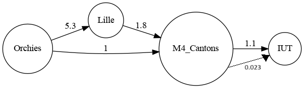

Votre rapport doit suivre le plan donné dans ce document.
  
Contraintes à respecter pour le rapport
  
- [ ] format: Markdown qu'on peut lire sur gitlab, ou pdf, ou html
- [ ] rapport dans un répertoire `graphes` à la racine du dépôt git
- [ ] rapport prêt le 21/06/2024; aucun délai supplémentaire ne sera accordé quelle que soit la raison donnée. Concrètement, on va récupérer la dernier daté au plus tard le 21/06/2024 et on ne verra même pas de version ultérieure du rapport, si elles existent. Minuit et une minute du 22/06/2024 sera trop tard
- [ ] respecte le plan donné ci-dessous
- [ ] garder les explications *en italique* jusque la fin pour s'y référer en écrivant le rapport
- [ ] supprimer les explications *en italique* juste avant de rendre la version finale du rapport
- [ ] le rapport est un texte **rédigé** avec des phrases intelligibles (on ne se contente pas de répondre laconiquement aux questions posées)
  
Idéalement, le rapport est rédigé au fur et à mesure avec le calendrier donné dans le sujet:
  
- section Version 1 faite avant le 18/05/2024 (1pt/20 si c'est le cas)
- section Version 2 faite avant le 08/06/2024 (1pt/20 si c'est le cas)
  
Finalement, l'utilisation d'un outils de génération de langage est autorisées, à condition de le faire intelligemment. En particulier, veillez à:
- avoir un rapport cohérent avec un style cohérent sur la totalité du document (niveau de langage, richesse du vocabulaire, termes utilisés, verbosité, ...)
- un rapport trop verbeux est fastidieux à lire. Si vous utilisez un outil pour faire du texte verbeux inutile, on utilisera un outil pour en faire un résumé et on corrigera uniquement le résumé
- les outils de génération insèrent parfois des phrases ne faisant pas partie du texte, mais qui s'adressent à l'interlocuteur (par exemple, pour vous informer que la limite de 2000 tokens est atteinte). La présence de telles phrases dans le rapport indique que vous n'avez pas relu et sera lourdement pénalisée.
  
  
**Début du rapport** Tout ce qui précède sera enlevé pour la version finale
  
------------------------------------------
  
SAE S2.02 -- Rapport pour la ressource Graphes
===
  
*DARQUES Charlie, LEFEBVRE Florine, CHARLERY Klara, groupe C*
  
  
Version 1 : un seul moyen de transport
---
  
### Présentation d'un exemple
  
Marie habite à Orchies et souhaite se rendre à l'IUT de Villeneuve d'Ascq afin de se rendre au cours de graphe de Mme Boneva en amphithéâtre. Pour se faire elle possède 4 options; Marie a la possibilité de prendre le train depuis Orchies jusque Lille et d'emprunter le métro jusque Villeneuve d'Ascq, de prendre le bus jusque Villeneuve d'Ascq puis prendre une navette gratuite jusque l'IUT ou elle peut prendre le métro pour 1 arrêt. Pour arriver jusqu'à son lieu d'étude Marie préfère prendre le bus et souhaite économiser son argent afin de pouvoir partir à Barcelone cet été, elle souhaite donc avoir tout les trajets disponibles afin de faire son choix.
Selon elle, les meilleures sont ceux durant lesquels elle emprunte le bus car le prix du trajet est peu couteux comparé à celui pour le train.
  
  
| Départ | Arrivée | Moyen | Prix | Pollution | Durée |
|:-------:|:-------:|:------:|:-------:|:-------:|:-------:|
| Orchies |  Lille | Train| 5.30 | 0.3366 | 20 |
| Lille | 4 Cantons | Métro | 1.80 |  0.388 | 12 |
| Orchies | 4 Cantons | Bus | 1 | 22.374 | 30 |
| 4 Cantons |  IUT |  Métro | 1.10 | 0.056 | 2 |
| 4 Cantons | IUT | Bus | 0 | 0.023 | 15 |
  
### Modèle pour l'exemple
  

  
Les meilleurs chemins sont (dans l'ordre décroissant) :
1. Orchies(bus) - 4 Cantons (bus) - IUT pour 1€
1. Orchies(bus) - 4 Cantons (métro) - IUT pour 2.10€
1. Orchies(train) - Lille (métro) - 4 Cantons (bus) - IUT pour 7.10€
  
### Modélisation pour la Version 1 dans le cas général
  
De manière général, la totalité des villes ou lieux par lesquels nous souhaitons passer sont représentés par les différents sommets du graphes. Dans le cas de la recherche d'itinéraire, nous utilisons des graphes connexes qui possèdent comme poids sur leur arêtes, le critère d'optimisation de l'utilisateur afin de trouver le chemin le plus optimal pour celui-ci. Pour notre projet nous nous retrouvons dans une situation avec des graphes connexes, non orienté et ne possédant pas d'arête de poids négatif, afin de pouvoir trouver les k plus courts chemins vers le point A au point B l'algorithme de Dijkstra est alors parfaitement optimal à la situation. Si nous étions dans le cas de trajet à coût négatif (ce qui est très peu plausible) nous aurions sélectionné l'algorithme de Bellman qui nous aurait permis de parcourir nos graphes.
  
Dans le cadre de notre exemple voici la composition de notre graphe :
- 4 sommets différents : Orchies, Lille, 4 Cantons, IUT.
- 5 arêtes : Orchies(Bus) - 4 Cantons (1)
              Orchies(Train) - Lille (5.30)
              Lille(Métro) - 4 Cantons (1.80)
              4 Cantons (Métro) - IUT (1.10)
              4 Cantons (Bus) - IUT  (0)
  
### Implémentation de la Version 1
  **GrapheTest.java**, **17-05-2024 b45a017c389c30409b5b218a9bd0d1358d8cc2aa** **https://gitlab.univ-lille.fr/sae2.01-2.02/2024/C1/-/blob/main/test/GrapheTest.java?ref_type=heads**.
  
Version 2 : multimodalité et prise en compte des correspondances
---
  
### Présentation d'un exemple
Marie habite à Orchies et souhaite se rendre à l'IUT de Villeneuve d'Ascq afin de se rendre au cours de graphe de Mme Boneva en amphithéâtre. Pour se faire elle possède 4 options; Marie a la possibilité de prendre le train depuis Orchies jusque Lille et d'emprunter le métro jusque Villeneuve d'Ascq sachant que pour se rendre de la gare à la station de métro cela lui prend 2 minutes à pied, de prendre le bus jusque Villeneuve d'Ascq puis prendre une navette gratuite jusque l'IUT qui lui rajoute 5 minutes sur son trajet qui correspondent au trajet entre les deux arrêts de bus ainsi que le temps d'attente entre les deux ou elle peut prendre le métro pour 1 arrêt avec 3 minutes en plus sur son trajet . Contrairement à la semaine dernière Marie a beaucoup de rendu cette semaine et se couche tard afin de pouvoir tout rendre. Afin d'avoir les huit heures de sommeil préconisé par les médecin, elle souhaite pouvoir dormir plus au détriment de son porte-monnaie, et cherche à connaître les 2 routes les plus courtes afin d'arriver à l'IUT
  
Plateforme :
| Départ | Arrivée | Moyen | Prix | Pollution | Durée |
|:-------:|:-------:|:------:|:-------:|:-------:|:-------:|
| Orchies_train |  Lille_train | Train| 5.30 | 0.3366 | 20 |
| Lille_train | 4 Cantons_train | Métro | 1.80 |  0.388 | 12 |
| Orchies_bus | 4 Cantons_bus | Bus | 1 | 22.374 | 30 |
| 4 Cantons_train |  IUT |  Métro | 1.10 | 0.056 | 2 |
| 4 Cantons_bus | IUT | Bus | 0 | 0.023 | 15 |
  
Correspondance :
| Ville |Correspondance | entre | Prix | Kg C0² | Durée |
|:-------:|:-------:|:------:|:-------:|:-------:|:-------:|
| Lille_train | Train | Bus | 0 | 0 | 10 |
| Lille_train | Train | Train | 0 | 0 | 2 |
| Lille_train | Bus | Bus | 0 | 0 | 3 |
| 4 Cantons_bus | Bus | Bus | 0 | 0 | 10 |
| 4 Cantons_bus | Bus | Train | 0 | 0 | 5 |
| 4 Cantons_bus | Train | Bus | 0 | 0 | 10 |
| 4 Cantons_bus | Train | Train | 0 | 0 | 3 |
| 4 Cantons_train | Bus | Bus | 0 | 0 | 10 |
| 4 Cantons_train | Bus | Train | 0 | 0 | 5 |
| 4 Cantons_train | Train | Bus | 0 | 0 | 10 |
| 4 Cantons_train | Train | Train | 0 | 0 | 3 |
  
### Modèle pour l'exemple

  
Les meilleurs chemins sont (dans l'ordre décroissant) :
1. Orchies_train - IUT en 60 minutes 
1. Orchies_train - 4 Cantons_train - 4 Cantons_bus - IUT en 62 minutes
  
*En réalisant le deuxième exemple pour la version 2 nous nous sommes rendus compte que le premier graphe était orienté alors qu'il n'était pas sencé l'être*
### Modélisation pour la Version 2 dans le cas général
  
De manière général, la totalité des villes ou lieux par lesquels nous souhaitons passer sont représentés par les différents sommets du graphes. Dans le cas de la recherche d'itinéraire, nous utilisons des graphes connexes qui possèdent comme poids sur leur arêtes, le critère d'optimisation de l'utilisateur afin de trouver le chemin le plus optimal pour celui-ci. Pour notre projet nous nous retrouvons dans une situation avec des graphes connexes, non orienté et ne possédant pas d'arête de poids négatif, afin de pouvoir trouver les k plus courts chemins vers le point A au point B l'algorithme de Dijkstra est alors parfaitement optimal à la situation. Si nous étions dans le cas de trajet à coût négatif (ce qui est très peu plausible) nous aurions sélectionné l'algorithme de Bellman qui nous aurait permis de parcourir nos graphes.
  
Dans le cadre de notre exemple voici la composition de notre graphe :
- 7 sommets différents : Depart, Orchies_train, Orchies_bus, Lille_train, 4 Cantons_bus, 4 Cantons_train, IUT.
  
- 5 arêtes :
            ; Orchies_train ;  Lille_train ; Train; 5.30  
            ; Lille_train ; 4 Cantons_train ; Métro ; 1.80  
            ; Orchies_bus ; 4 Cantons_bus ; Bus ; 1  
            ; 4 Cantons_train ;  IUT ;  Métro ; 1.10  
            ; 4 Cantons_bus ; IUT ; Bus ; 0  
  
- 11 correspondances différentes possible :
              Lille_train ; Train ; Bus ; 0 ; 0 ; 10  
              Lille_train ; Train ; Train ; 0 ; 0 ; 2  
              Lille_train ; Bus ; Bus ; 3 ; 0 ; 3  
              4 Cantons_bus ; Bus ; Bus ; 0 ; 0 ; 10  
              4 Cantons_bus ; Bus ; Train ; 0 ; 0 ; 5  
              4 Cantons_bus ; Train ; Bus ; 0 ; 0 ; 10  
              4 Cantons_bus ; Train ; Train ; 0 ; 0 ; 3  
              4 Cantons_train ; Bus ; Bus ; 0 ; 0 ; 10  
              4 Cantons_train ; Bus ; Train ; 0 ; 0 ; 5  
              4 Cantons_train ; Train ; Bus ; 0 ; 0 ; 10  
              4 Cantons_train ; Train ; Train ; 0 ; 0 ; 3  
  
Contrairement à la première version du rendu nous devons prendre en compte les différents coût des correspondances que peut emprunter l'utilisateur. Dans la deuxième version cela a été représenté par l'ajout de plusieurs sommets désigné par le nom du sommet de la version 1 ainsi que le moyen de transport emprunté, afin de pouvoir gérer les différents coûts de type ( Train - Train ) ou encore ( Train - Bus ). Dans notre exemple les coûts de correspondance correspondant majoritairement à du temps supplémentaire nous avons préféré changé légèrement notre exemple avec Marie qui souhaite dormir plus le matin au lieu de vouloir économiser pour partir en vacances.
  
### Implémentation de la Version 2
 **GrapheTest.java**, **07-06-2024 01b82d94** **https://gitlab.univ-lille.fr/sae2.01-2.02/2024/C1/-/commit/01b82d9490b5a841011063c149a85f4f3e9857cb**.
  
  
Version 3 : optimisation multi-critères
---
### Présentation d'un exemple 

Marie habite à Orchies et souhaite se rendre à l'IUT de Villeneuve d'Ascq afin de se rendre au cours de graphe de Mme Boneva en amphithéâtre. Pour se faire elle possède 4 options; Marie a la possibilité de prendre le train depuis Orchies jusque Lille et d'emprunter le métro jusque Villeneuve d'Ascq sachant que pour se rendre de la gare à la station de métro cela lui prend 2 minutes à pied, de prendre le bus jusque Villeneuve d'Ascq puis prendre une navette gratuite jusque l'IUT qui lui rajoute 5 minutes sur son trajet qui correspondent au trajet entre les deux arrêts de bus ainsi que le temps d'attente entre les deux ou elle peut prendre le métro pour 1 arrêt avec 3 minutes en plus sur son trajet . Contrairement à la semaine dernière Marie a beaucoup de rendu cette semaine et se couche tard afin de pouvoir tout rendre. Afin d'avoir les huit heures de sommeil préconisé par les médecin, elle souhaite pouvoir dormir plus au détriment de son porte-monnaie néanmoins Marie est très soucieuse de l'environnement et souhaite prendre l'itinéraire le plus responsable éccologiquement. Elle cherche à connaître les 2 routes les plus courtes afin d'arriver à l'IUT tout en protégeant la planète.

Plateforme :
| Départ | Arrivée | Moyen | Prix | Pollution | Durée |
|:-------:|:-------:|:------:|:-------:|:-------:|:-------:|
| Orchies_train |  Lille_train | Train| 5.30 | 0.3366 | 20 |
| Lille_train | 4 Cantons_train | Métro | 1.80 |  0.388 | 12 |
| Orchies_bus | 4 Cantons_bus | Bus | 1 | 22.374 | 30 |
| 4 Cantons_train |  IUT |  Métro | 1.10 | 0.056 | 2 |
| 4 Cantons_bus | IUT | Bus | 0 | 0.023 | 15 |
  
Correspondance :
| Ville |Correspondance | entre | Prix | Kg C0² | Durée |
|:-------:|:-------:|:------:|:-------:|:-------:|:-------:|
| Lille_train | Train | Bus | 0 | 0 | 10 |
| Lille_train | Train | Train | 0 | 0 | 2 |
| Lille_train | Bus | Bus | 0 | 0 | 3 |
| 4 Cantons_bus | Bus | Bus | 0 | 0 | 10 |
| 4 Cantons_bus | Bus | Train | 0 | 0 | 5 |
| 4 Cantons_bus | Train | Bus | 0 | 0 | 10 |
| 4 Cantons_bus | Train | Train | 0 | 0 | 3 |
| 4 Cantons_train | Bus | Bus | 0 | 0 | 10 |
| 4 Cantons_train | Bus | Train | 0 | 0 | 5 |
| 4 Cantons_train | Train | Bus | 0 | 0 | 10 |
| 4 Cantons_train | Train | Train | 0 | 0 | 3 |

### Modèle pour l'exemple 

  
Les meilleurs chemins sont (dans l'ordre décroissant) :
1. Orchies(bus)  - IUT pour 26€
1. Orchies(bus)  - IUT pour 26€
1. Orchies(train) - IUT pour 40€

### Modélisation de la Version 3 dans le cas général 

De manière général, la totalité des villes ou lieux par lesquels nous souhaitons passer sont représentés par les différents sommets du graphes. Dans le cas de la recherche d'itinéraire, nous utilisons des graphes connexes qui possèdent comme poids sur leur arêtes, le critère d'optimisation de l'utilisateur afin de trouver le chemin le plus optimal pour celui-ci.Pour le troisième version de notre Application nous avons mis en place un système de poids entre les différents critères qui peuvent être choisis par l'utilisateur qui est proportionnelle en fonction du poid maximal de celle-ci. Pour notre projet nous nous retrouvons dans une situation avec des graphes connexes, non orienté et ne possédant pas d'arête de poids négatif, afin de pouvoir trouver les k plus courts chemins vers le point A au point B l'algorithme de Dijkstra est alors parfaitement optimal à la situation. Si nous étions dans le cas de trajet à coût négatif (ce qui est très peu plausible) nous aurions sélectionné l'algorithme de Bellman qui nous aurait permis de parcourir nos graphes.
  
Dans le cadre de notre exemple voici la composition de notre graphe :
- 7 sommets différents : Depart, Orchies_train, Orchies_bus, Lille_train, 4 Cantons_bus, 4 Cantons_train, IUT.
  
- 5 arêtes :
            ; Orchies_train ;  Lille_train ; Train; 5.30  
            ; Lille_train ; 4 Cantons_train ; Métro ; 1.80  
            ; Orchies_bus ; 4 Cantons_bus ; Bus ; 1  
            ; 4 Cantons_train ;  IUT ;  Métro ; 1.10  
            ; 4 Cantons_bus ; IUT ; Bus ; 0  
  
- 11 correspondances différentes possible :
              Lille_train ; Train ; Bus ; 0 ; 0 ; 10  
              Lille_train ; Train ; Train ; 0 ; 0 ; 2  
              Lille_train ; Bus ; Bus ; 3 ; 0 ; 3  
              4 Cantons_bus ; Bus ; Bus ; 0 ; 0 ; 10  
              4 Cantons_bus ; Bus ; Train ; 0 ; 0 ; 5  
              4 Cantons_bus ; Train ; Bus ; 0 ; 0 ; 10  
              4 Cantons_bus ; Train ; Train ; 0 ; 0 ; 3  
              4 Cantons_train ; Bus ; Bus ; 0 ; 0 ; 10  
              4 Cantons_train ; Bus ; Train ; 0 ; 0 ; 5  
              4 Cantons_train ; Train ; Bus ; 0 ; 0 ; 10  
              4 Cantons_train ; Train ; Train ; 0 ; 0 ; 3  

## Implementation de la Version 3  

*Donner ici le **Graphe Test**, **18/06/2024 b2a79a31** et un **https://gitlab.univ-lille.fr/sae2.01-2.02/2024/C1/-/commit/b2a79a31bb81291bff715f01f4f40f9226a4bf51***.

----------------------------------------------------
  
**Fin du rapport**
  
### Barème sur 30 pts
  
Toute question sur le barème est à adresser à iovka.boneva@univ-lille.fr
  
  
- Rapport non rendu à temps -> note 0
- **(7, décomposé comme suit)** Divers
  - **(1,5)** Respect de la structure du rapport
  - **(1,5)** Section Version 1 rendue pour le 18/05/2024. Cette version peut contenir les parties en italique.
  - **(1,5)** Section Version 2 rendue pour le 08/06/2024. Cette version peut contenir les parties en italique.
  - **(1)** Utilisation de vocabulaire précis sur les graphes (termes vu en cours, noms des algorithmes, etc.)
  - **(1,5)** Style d'écriture fluide et compréhensible
  
- **(8, décomposé comme suit)** Solution pour la Version 1
  - **(2)** Exemple pertinent (illustre tous les aspects du problème) et lisible (en particulier, ni trop grand ni trop petit, bien présenté)
  - **(4)** Le modèle de l'exemple permet de trouver la solution sur l'exemple. La modélisation pour le cas général permet de résoudre le problème posé
  - **(2)** L'implémentation de l'exemple est correcte et fonctionnelle
  
- **(6, décomposé comme suit)** Solution pour la Version 2
  - **(1)** Exemple pertinent
  - **(4)** le modèle de l'exemple permet de trouver la solution sur l'exemple. La modélisation pour le cas général permet de résoudre le problème posé
  - **(1)** L'implémentation de l'exemple est correcte et fonctionnelle
  
- **(3)** Qualité de la description de la solution (concerne les sections "Modèlisation dans le cas général" pour les Versions 1 et 2):
  - La modélisation pour le cas général est décrite de manière abstraite mais précise et complète. Pour vous donner une idée, un·e étudiant·e de BUT qui a validé les ressources Graphes et Dev devrait être en mesure d'implémenter votre solution d'après la description que vous en faites, sans avoir à trop réfléchir.
  
- **(6)** Solution pour la Version 3: mêmes critères que pour la Version 2